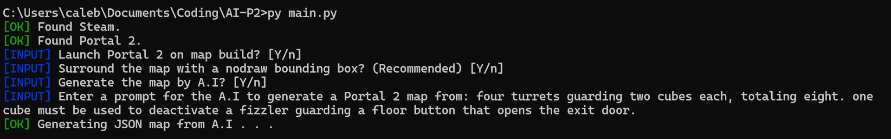
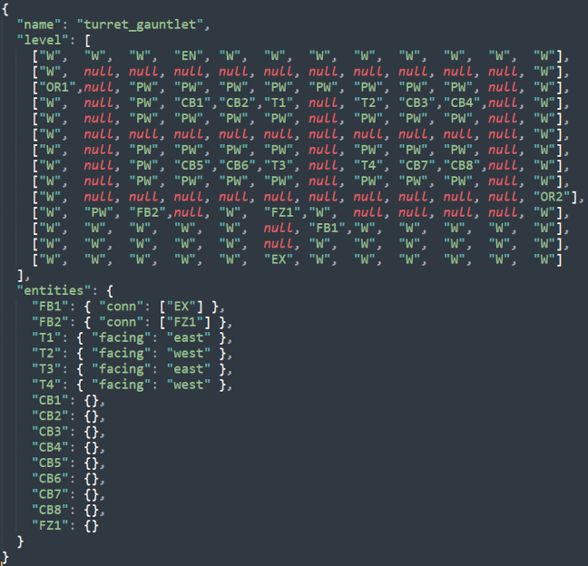
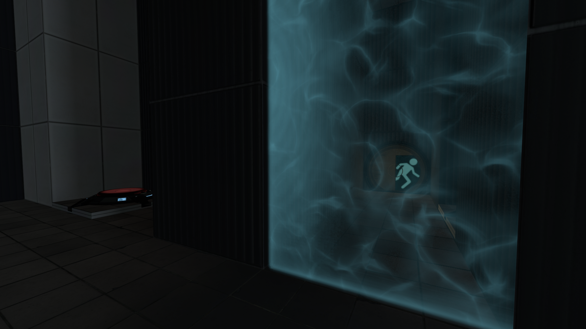
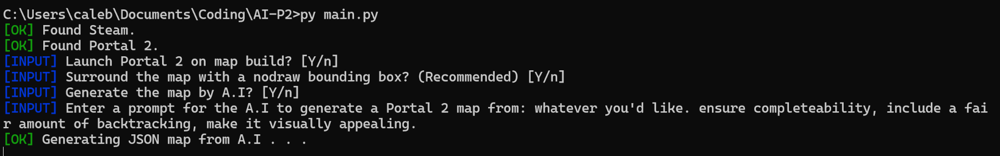
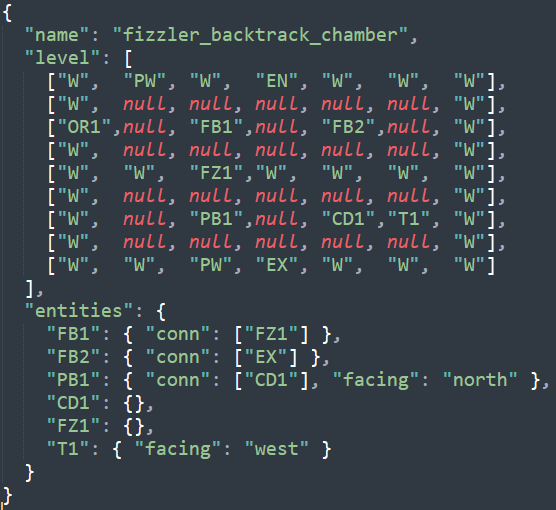
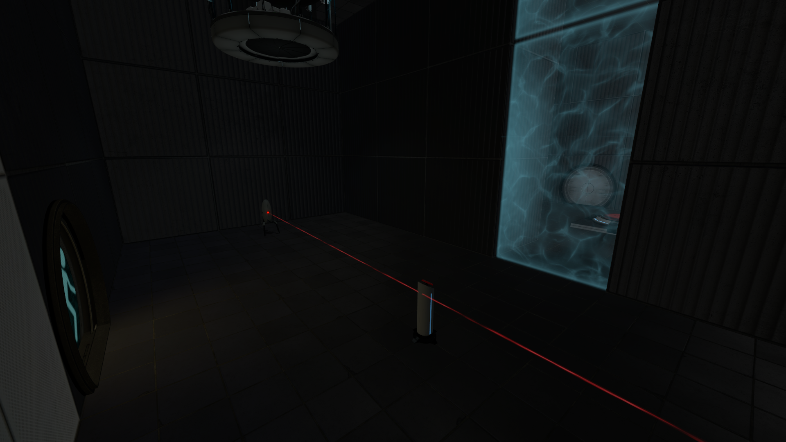
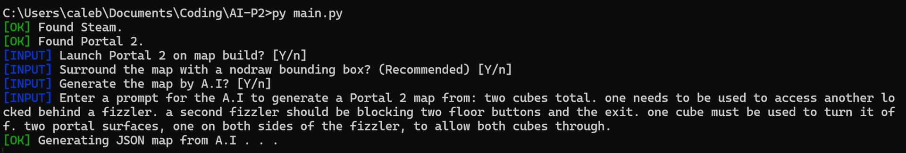
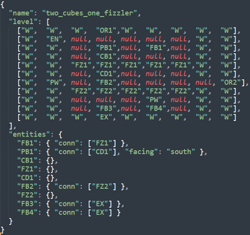
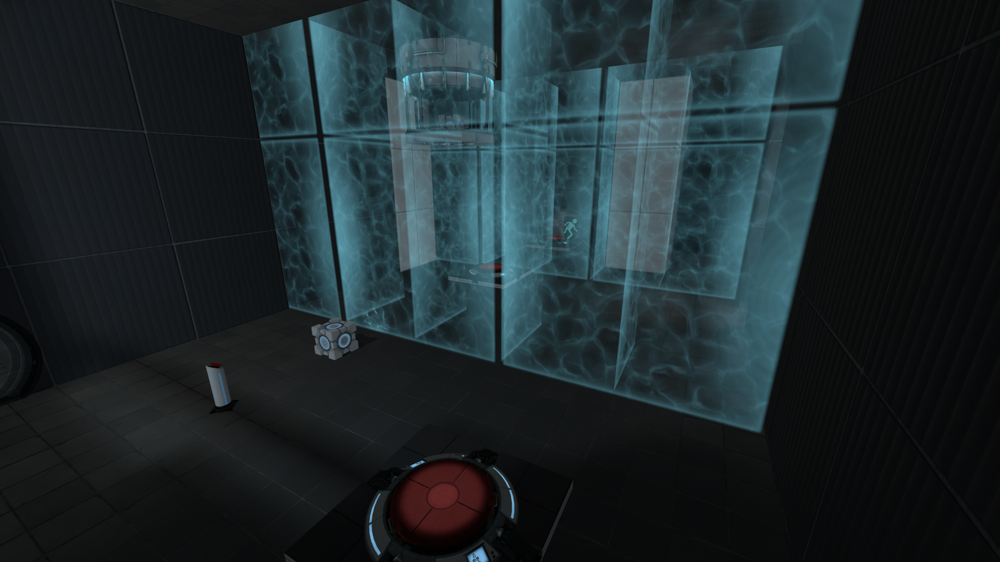

# ai-p2

Automated pipeline for generating and compiling playable Portal 2 test chambers from JSON definitions.

Supports optional AI-assisted generation via Google Gemini.

## Requirements
- Python 3
- Portal 2 installed via Steam
- `pip install google-genai` (optional, for AI features)

## Usage
1. Configure `config.ini` with Steam / Portal 2 paths and your Gemini API key.
2. Run: `python main.py`

Generated maps are compiled and launched directly into Portal 2 for testing.

## Example Levels
<table align="center" width="100%">
  <tr>
    <td align="center"><b>Prompt</b></td>
    <td align="center"><b>Generated JSON</b></td>
    <td align="center"><b>In-Game Result</b></td>
  </tr>

  <tr>
    <td width="55%" align="center">
      
    </td>
    <td width="20%" align="center">
      
    </td>
    <td width="25%" align="center">
      
    </td>
  </tr>

  <tr>
    <td width="55%" align="center">
      
    </td>
    <td width="20%" align="center">
      
    </td>
    <td width="25%" align="center">
      
    </td>
  </tr>

  <tr>
    <td width="55%" align="center">
      
    </td>
    <td width="20%" align="center">
      
    </td>
    <td width="25%" align="center">
      
    </td>
  </tr>
</table>

## Notes
A puzzle solver is planned but not yet implemented.

### Happy testing!
